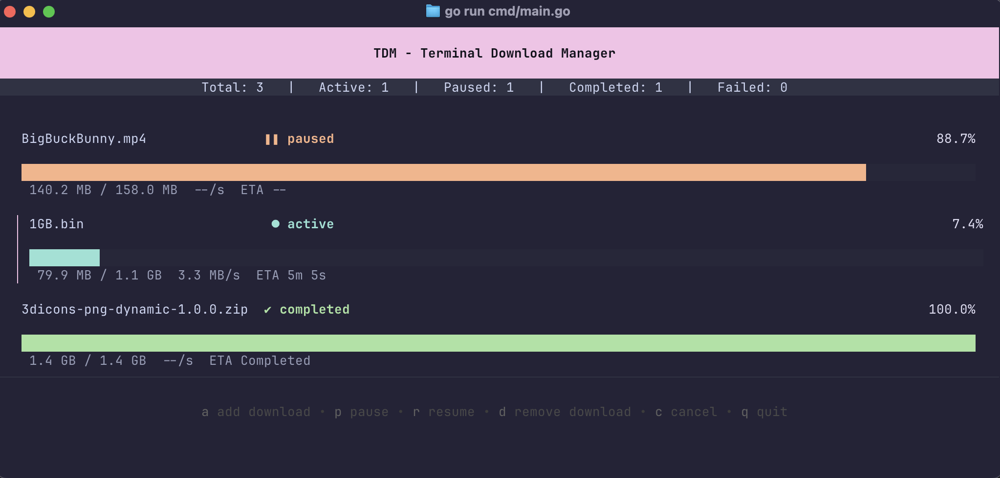

# TDM (Terminal Download Manager)

[](https://goreportcard.com/report/github.com/NamanBalaji/tdm)

## 🚀 Overview

TDM is a fast, lightweight, and feature-rich download manager that runs directly in your terminal. Designed for efficiency and ease of use, TDM provides a powerful solution for downloading files with advanced capabilities.

## ✨ Features

### 🔥 Download Engine
- **Multi-connection downloading**
    - Parallel connections per file (8-16 by default)
    - Automatic fallback to a single connection for unsupported servers
- **Intelligent Chunk Management**
    - Dynamic c sizing
    - Automatic c merging and verification
- **Robust Resume/Recovery**
    - Automatic resume for interrupted downloads
    - Graceful handling of partial content downloads

### 🌐 Protocol Support
- **Current Protocols**
    - HTTP/HTTPS
- **Upcoming Protocols**
    - FTP
    - SFTP
    - BitTorrent

### 🚦 Download Management
- Prioritized download queue
- Pause, resume, and cancel downloads
- Comprehensive download status tracking
- Configurable retry mechanisms

### 🖥️ Terminal User Interface (TUI)
- Intuitive, colorful interface
- Real-time download progress
- Bandwidth and speed monitoring
- Chunk-level status display

## 🖼️ Screenshot



## 🛠️ Installation
- Download the binary from the release page 
- Add it to your path 
- Then simply run tdm from your shell

### Install from Source
```bash
git clone https://github.com/NamanBalaji/tdm.git
cd tdm
go build
./tdm
```

## 🔧 Configuration

TDM offers extensive configuration options:
- Maximum concurrent downloads
- Connection per download
- Bandwidth throttling
- Retry attempts
- Default save locations

## 🗂️ Upcoming Features

### 📡 Protocol Expansion
- [ ] FTP protocol support
- [ ] BitTorrent implementation

### 🧠 Smart Download Optimization
- [ ] Dynamic c size calculation
- [ ] Adaptive bandwidth management


## 🤝 Contributing

Contributions are welcome! Please feel free to submit a Pull Request.

### Development Setup
1. Clone the repository
2. Install dependencies: `go mod download`
3. Run tests: `go test ./...`
4. Build: `go build`
